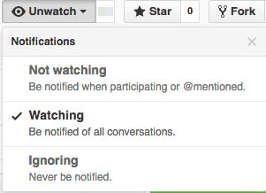

# Welcome to Wizeline!

We maintain the documents in this repo to help team members understand
**and help define**...

- what we do
- how we do it &mdash; _e.g._, practices, standards, tools, _etc_.
- why/how we made these decisions &mdash; via commit history,
[Pull Requests](https://github.com/wizeline/wize-docs/pulls) & comments, _etc_.

### Please...

- read the [contribution guidelines](CONTRIBUTING.md) for more information
- watch this repo to be notified of conversations, proposals, _etc_.
via e-mail so you can decide if/when you wish to participate!

  

## Sections

- [Engineering Ladder](engineering-ladder/README.md)
- [Development practices](development/README.md)
- [Interviewing/Hiring](interview-process/README.md)
- Onboarding - [Services-GDL](onboarding/services-gdl.md)

### Repo _vs_ Wiki

Based, in part, on this
[presentation](https://www.youtube.com/watch?v=YIpNpptGX6Q)
and its
[slides](https://speakerdeck.com/rkbodenner/changing-the-laws-of-engineering-with-github-pull-requests-velocity-santa-clara-2015),
things in the **repo** are cultural 'norms', standards, and practices;
things which deserve and require discussion and agreement to change &mdash;
'Law', if you like.

In contrast, the [**wiki**](https://github.com/wizeservices/wize-docs/wiki)
is a great place to collect and share things which do not require/deserve
discussion and agreement &mdash; ideas, resources, _etc_.

Please add and maintain information in the wiki, adding and editing pages as
needed!

## Your success is part of our success!

### If you're just starting with us

Please read through these files/documents.

Just as importantly, *please* help us improve them. **Right now**, you are
our **best expert** on being a new-hire.

If you have any questions *please*
- ask someone
- create a branch and submit a Pull Request (PR) with your improvement(s)

Your changes will help future new-hires (and all of us!) be more successful
more quickly!

### Even if you have been with us for "a while"

Please refer back to these documents on a regular basis and help
**keep them up-to-date**.
- add new information, practices, standards, _etc_.
- update things we've changed
- remove things that aren't relevant any more

If you're not sure, **ask** other team members &mdash;
**we're all in this together!**
