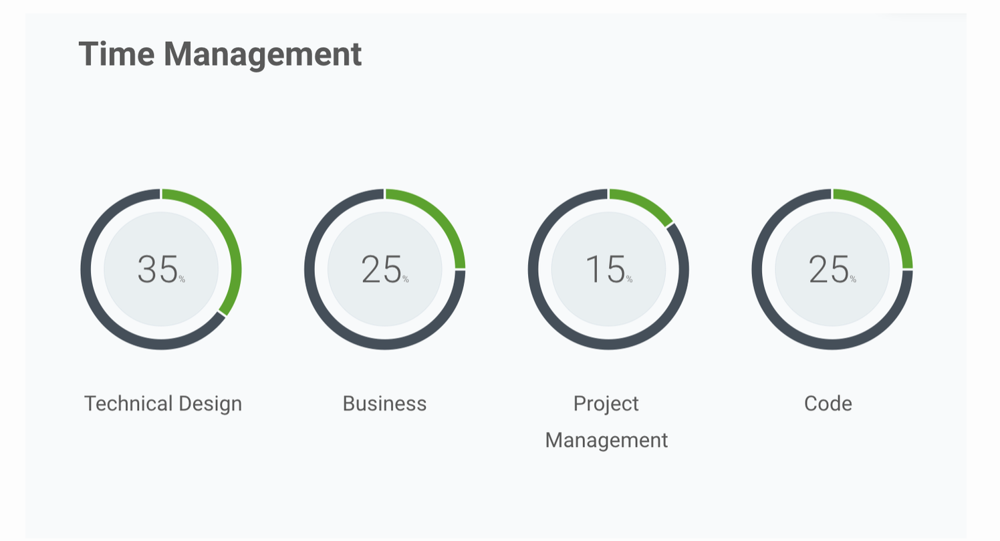

[Home](../README.md) |
[Engineering Ladder](README.md) |
[Tech Lead](tech-lead.md)

<!-- Maintainer: benjamin.gil, https://wizeline.slack.com/messages/D99T3VAT0/ -->

# Tech Lead Position Overview

## Definition

Looks for the technical direction of a project and is the go person for cross team communication and interactions. A developer that is a leader. 

> A successful Tech Lead takes on responsibilities that sit with roles such as the Team Lead, the Architect and the Engineering Manager. They bring a unique blend of leadership and management skills applied in a technical context with a team of developers. The Tech Lead steers a team towards a common technical vision, writing code at least 30% of the time.

## Areas of Knowledge

* Technical Leadership

* Technical Guidance

    * Set Guidelines 
    * Decide which tools to use
    * Patterns

* Risk and Requirements

    * Identify 
    * Mitigate
    * Communicate

* Coaching and Mentorship

    * Generate a feedback culture
    * Create psychological safety
    * Coach more junior devs
    * Know when to coach and when to mentor

* Communication

    * Speak others "languages"
    * Link objectives across teams

# Observed Behaviors

Be a change advocate, observe, act and decide on how and when to act upon. 

Be part of the team, experience the same "pains" to have real context and continuously look for improvements. 

Be sure that the team learns from failure without finger pointing. 

Embrace non functional requirements like networking, security, efficiency, consistency

Be available for the team, prepare work upfront

(Create user stories, define acceptance criterias, be present on UX checkpoints, communicate risks to client, align business with tech decisions, prioritize tasks, etc)


Be realistic, know when something needs help from other team, when something will require a POC. 

Understand the business goals and priorities and how they align with contract, scoping, relationship; the way the client acquires technology, etc. 

Negotiate with the team, communicating clearly drawbacks and benefits of doing things a certain way. 

Help the team build a system not only software. 

## Non-Career Ladder Behaviors

The following behaviors are identified among tech leads but are not directly present on the software engineer career ladder.

Be a requirement transpiler, learn what each team needs from the others to perform their job the best.

Be the main point of contact across the team, help to communicate the importance of each topic and the possible impacts that decisions could have over development and vice versa.

Estimate and help sales and delivery team understand the constraints and needed info to create an accurate scope and a consistent SOW.

Motivate individuals in the team, learn their goals and preferences. Place team members on a position to succeed.  

Generate an environment where conflict can be solved

Stay technical, lead new features, POCs, code review, technical vision, best practices. Be able to communicate why the decisions made matter or were made. 

Make sure to congratulate and make visible the effort of each individual, help the team better communicate their work and achievements. 

Steer a team towards a common technical vision

Take decisions being bias for action, learn when the team can’t stand more tech debt and which things are easily reversible. 

## Career Ladder Behaviors

The following behaviors are traits identified among tech leads:

**Leads** planning efforts and the execution of the technical schedule for one or several working teams. In such a way, that teams consistently complete project tasks on a timely manner.

**Serves** as a technical referent by helping teammates to clarify technical questions and share knowledge and experiences.

**Facilitates** agreement within the team. Listens actively and can ask the right questions to understand a given problem.

**Fosters** Psychological Safety. Is patient and kind.

**Represents** the team in conversations with customers. Can hold technical and business discussions with external stakeholders.

**Influences** people within a project to get work done.

**Identifies** areas of improvement, resource constraints and/or potential risks on the project. Foresees future problems at the design phase and plans to prevent them. By doing so, boosts the performance and proficiency of the team.

**Promotes** a growth mentality within his/her team by: celebrating trying, embracing challenges and promoting feedback.

**Promotes** a feedback culture within the team by giving and receiving feedback, and creating awareness of its importance through the learning process.

**Owns** higher level onboarding for the project. Can teach how systems in the project interact, choice of stack, and business logic, etc... Owns project onboarding documentation, including designing KT sessions and how-to guides.

Is a technical and career development **mentor**.

**Understands** and models effective mentorship. Knows about learning styles, communication styles, psychological safety, giving and receiving feedback.

Is a go-to person for more than one area, mentors peers on the subject.
Is a technical expert consultant for other teams in their area(s) of expertise. Contributes to design and planning.

Ties back technical and project decisions with business goals; and helps the team understand these connections. 

**Builds** a trusting relationship with clients by understanding client's business needs and users needs, and facilitates its communication to the technical team.  
Articulates how his/her team's contributions connect with clients or users business needs.

Role models Wizeline Culture and is fundamental to linkage project's goals with the company's vision and business goals.

## References

* [Original Document](https://docs.google.com/document/d/1e4mZp4N1lSJRohUYkKROkFE4WYZtiHIACR_8Yy8U4lU/edit)
* Tips to become an awesome Technical Lead by Bart Blommaerts. [Blog post](https://ordina-jworks.github.io/architecture/2017/12/22/Tech-Lead.html), [Slides](https://www.slideshare.net/BartBlommaerts/10-tips-to-become-an-awesome-technical-lead), [Video](https://youtu.be/yhtK1jQC_4s)

[Home](../README.md) |
[Engineering Ladder](README.md) |
[Tech Lead](tech-leads.md)
