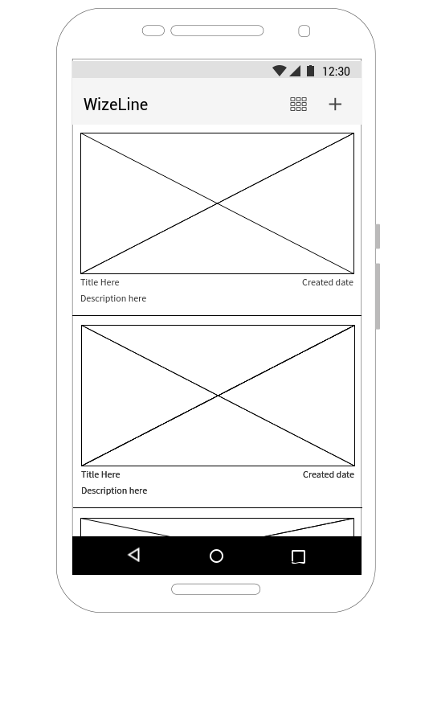
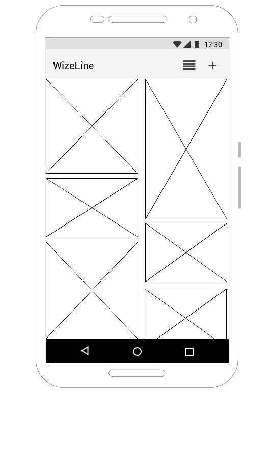
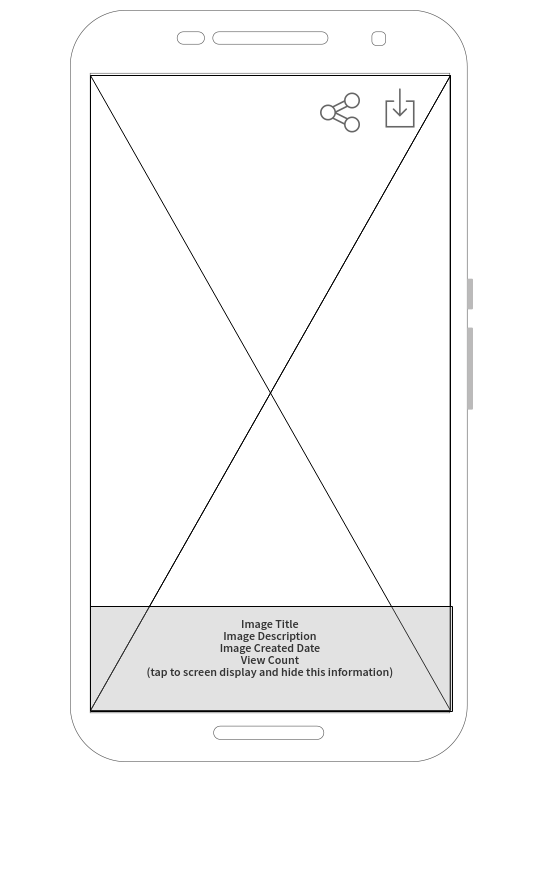
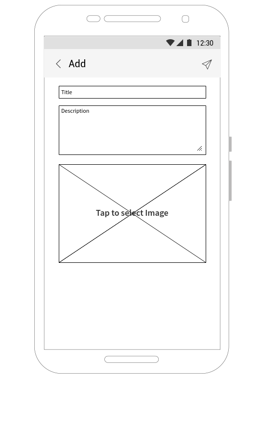

# Image Application Challenge

This is a *guide* for presenting the challenge to the candidate, *not* a document to give to the candidate.

## Overview

Create an application that displayed images from our wrapper imgur API

## Critical Points
- Display images as a list
- Display the full detail of an image

## Important Points
- Display images in a list with 2 columns and flexible height adjustment (as Pinterest)
- Application provides function to share image
- Post a new image from device

## Bonus Points
- User are able to download image into device's gallery
- Nice transition animation
- Display GIF images
- Save favorite images to local application's DB

## Endpoints
- Base URL `https://wzimgur.herokuapp.com`
- Login
  * POST `/login`
  * Sample
  ```
  curl -vs -X POST https://wzimgur.herokuapp.com/login -F username=wizeline
  ```
- Get Images
  * GET `/image`
  * Sample
  ```
  curl -X GET https://wzimgur.herokuapp.com/image -H 'authorization: bearer your-token'
  ```
- Get Thumbnail by ImageId
  * GET `/image/{imageId}`
  * Sample
  ```
  curl -X GET https://wzimgur.herokuapp.com/image/kaq3pry -H 'authorization: bearer your-token'
  ```


| Thumbnail Suffix | Thumbnail Name   | Thumbnail Size | Keeps Image Proportions |
|------------------|------------------|----------------|-------------------------|
| s                | Small Square     | 90x90          | No                      |
| b                | Big Square       | 160x160        | No                      |
| t                | Small Thumbnail  | 160x160        | Yes                     |
| m                | Medium Thumbnail | 320x320        | Yes                     |
| l                | Large Thumbnail  | 640x640        | Yes                     |
| h                | Huge Thumbnail   | 1024x1024      | Yes                     |


- Add a new Image
  * POST `/image`
  * Fields
    * file: image file
    * title: image’s title
    * description: image’s description
  * Sample
  ```
  curl -X POST https://wzimgur.herokuapp.com/image/ -H 'authorization: bearer your-token' -H 'content-type: multipart/form-data; boundary=----WebKitFormBoundary7MA4YWxkTrZu0gW' -F file=@/test/image.png -F title='test title' -F description='test description'
  ```

## UI Mockups
- Home screen





- Image Detail screen



- Add Image screen



## Google Docs
- [Onsite](https://drive.google.com/open?id=1n_9_eU0T8oU6h0NRTinK2BKU34QLNu1EQ0qIoQVBfBc)
- [Remote](https://drive.google.com/open?id=1NkOV6R0e2x7mAb1BhLS0QZDEi9L9y5ciIr5GuV-GxjI)

# Recommendations for the Coaches
- Before the candidate starts solving the challenge, ensure you:
  - Explain the challenge to the candidate.
  - Suggest them to test the APIs
  - Discuss to pick and focus on the right points that can be completed on time
- During the challenge, you can make the the following recommendations:
  - To use any tools, languages, frameworks, or databases they like.
  - Search on the web for any resources they need.
  - Ask any team members for help.
  - Not to invest much time on any given problem before asking for help.
- After the challenge, you need to make sure they submit a runnable project at that moment, and offer them another chance to re-submit within 12 hours
